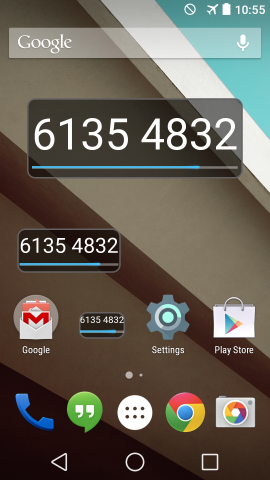
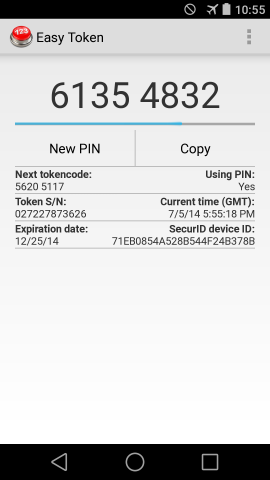

Easy Token
==========

Easy Token is an RSA SecurID-compatible software authenticator for Android
with advanced usability features:

* Convenient lock screen and home screen widgets provide instant tokencodes
without navigating to an app.
* Optionally save your PIN.
* Supports SDTID files, importing http://127.0.0.1/... tokens from email,
and QR tokens.
* 100% open source: https://github.com/cernekee/EasyToken

## Downloads

Official releases are posted in the
[XDA thread](http://forum.xda-developers.com/android/apps-games/app-easy-token-source-securid-token-t2805507)
and on
[Google Play](https://play.google.com/store/apps/details?id=app.easytoken).

No registration is required to download from XDA.

## Support

To report issues, please email the author at
[cernekee@gmail.com](mailto:cernekee@gmail.com) or post in the
[XDA thread](http://forum.xda-developers.com/android/apps-games/app-easy-token-source-securid-token-t2805507).

## Screenshots

&nbsp;

&nbsp;

## Building from source

On the host side you'll need to install:

* NDK r10, nominally under /opt/android-ndk-r10
* Host-side gcc, make, etc. (Red Hat "Development Tools" group or Debian build-essential)
* git, autoconf, automake, and libtool
* Android SDK in your $PATH (both platform-tools/ and tools/ directories)
* javac 1.6 and a recent version of Apache ant
* Use the Android SDK Manager to install API 19

First, clone the source trees:

    git clone git://github.com/cernekee/EasyToken
    cd EasyToken
    git submodule update --init

Then build the binary components (libs/ directory):

    make -C external NDK=/opt/android-ndk-r10

Then build the Java components:

    android update project -p .
    ant debug

Build logs can be found on this project's [Travis CI page](https://travis-ci.org/cernekee/EasyToken).

## Security considerations

Please use Easy Token responsibly and avoid taking unnecessary risks with
sensitive data.  All software tokens are at risk of theft by malware; for
high-security applications a hardware token is strongly preferred.

Saving your PIN is convenient, but can be risky if your device is stolen.

If you use the lock screen widget, your tokencode is available to anybody with
access to your phone (even if they cannot unlock it).  For this case, you may
want to ask your system administrator to issue a 6-digit PIN-less software
token, which will require you to enter PIN + TOKENCODE when logging in, instead
of just a tokencode.
